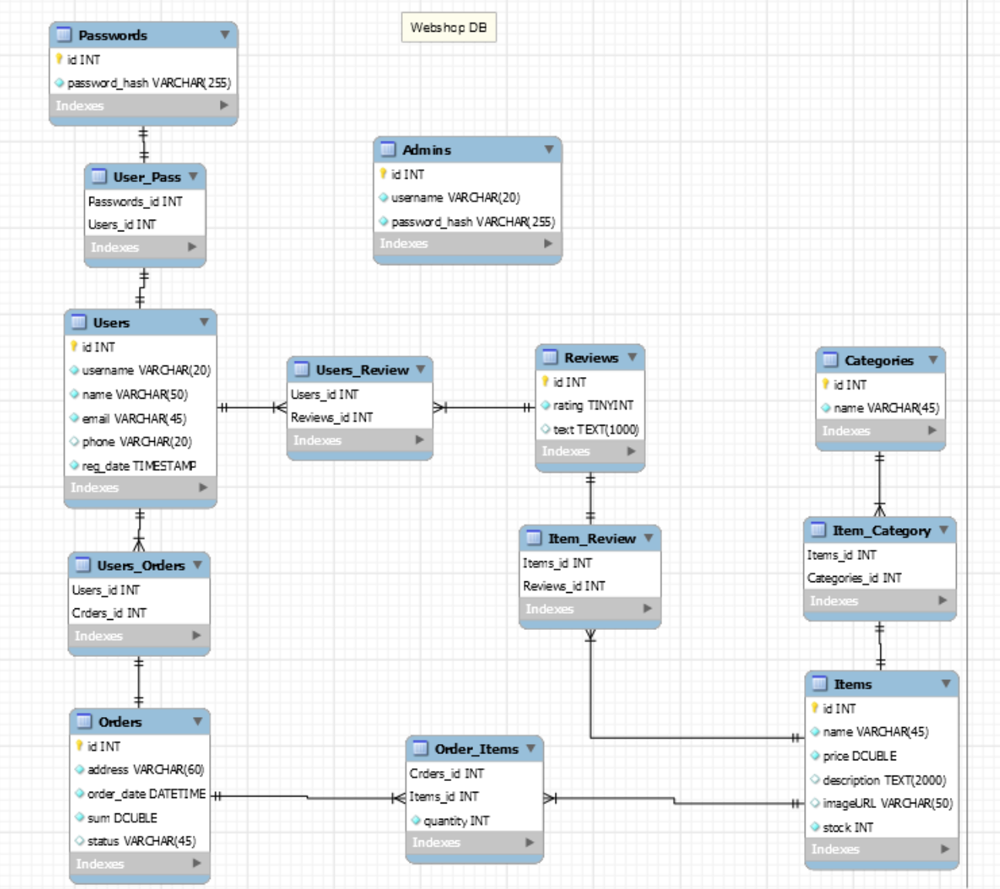

# Informatika 2 Házi feladat specifikáció
	Webshop
## A feladat informális leírása
A feladat célja egy webshop elkészítése, PHP HTML CSS JavaScript és adatbázis kezelés technológiák használatával. Cél, hogy a weboldalon lehessen megrendeléseket leadni illetve azokat adminisztrálni a bolt számára. A webshop elsődleges nyelve az angol.
## Elérhető funkciók
Az alkalmazás következő funkciókat biztosítja:
 * Webshop:
	* Regisztráció új felhasználók számára
	* Termékek keresése
	* Termékek kosárba helyezése
	* Megrendelés leadás
	* Megrendelések státuszának lekérdezése
	* Felhasználói profil szerkesztése
 * Adminisztrációs felület:
	* Új termék felvétele, termékek törlése
	* Termék adatainak szerkesztése
	* Megrendelések kezelése
	* Regisztrált felhasználók megtekintése, adataik törlése
	* Forgalmazott termékek kilistázása, raktárkészlet megjelenítése
## Adatbázis séma
Az adatbázis a következő entitásokat és attribútumokat tárolja:
 * Users: id, felhasználónév, név, email cím, telefonszám, regisztráció időpontja
 * Passwords: id, jelszó (hashelve)
 * Orders: id, szállítási cím, rendelés időpontja
 * Items: id, termék neve, termék ára, leírás, kép URL címe, raktárkészlet
 * Categories: id, kategória neve
 * Reviews: id, értékelés (1-5), értékelés szövege
 * Admins: id, admin felhasználóneve, admin jelszava hashelve

A MySQL Workbench-ben megtervezett adatbázis séma:

